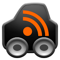

  

I have a commute. It's not a long commute, but long enough (20 minutes-ish). Although I enjoy listening to music while driving, **I've found that my time is better spent listening to something educational or interesting through podcasts.**<!--more-->

### How Do I Listen To Podcasts?

With the advent of smartphones, subscribing and listening to podcasts is super easy. I've never had an iPhone but I've seen that there's a podcast app in the App Store that should be sufficient (correct me if I'm wrong). For Android, Google used to make a nifty little app called Listen but has been discontinued. **The app I'm a big fan of right now is the [Car Cast Player](https://play.google.com/store/apps/details?id=com.jadn.cc) app.** It's made for listening to podcasts in the car and it does it well. There are other podcast players in the Google Play store but this is the best free one I've found.

The way you subscribe to a podcast is much like subscribing to an RSS feed. Most podcast players will have a way to either search for podcasts or link up to one through a feed URL. For example, if you wanted to subscribe to [Hanselminutes](http://www.hanselminutes.com/), I would first go to the site and find a subscribe link. Sometimes you can just hover over the link to find the feed URL that you can enter into your podcast player. **What I like to do is to actually subscribe to the feed into Google Reader so that I can read the show notes later.** This also makes it easy to refer to the subscription link later and verify that your podcast player is pulling podcasts correctly.

### So What Do You Listen To?

I created a nifty page that I'll try to keep up to date [here](/pages/podcasts/). But here's the short list version relevant to right now:

* [.Net Rocks!](http://www.dotnetrocks.com/)
* [Hanselminutes](http://www.hanselminutes.com/)
* [Herding Code](http://herdingcode.com/)
* [Javascript Jabber](http://javascriptjabber.com/)
* [Ratchet And The Geek](http://www.ratchetandthegeek.com/)
* [Ruby Rogues](http://rubyrogues.com/)
* [Software Engineering Radio](http://www.se-radio.net/)
* [This American Life](http://www.thisamericanlife.org/)
* [This Developer's Life](http://thisdeveloperslife.com/)

If you're not a programmer, find something you're interested in. There are a TON of podcasts covering whatever subject you may be interested in. So go forth and maximize your commute! Listen to some podcasts!

[Updated 3/12/2014]
I've moved my podcast list to a static page that I try to keep updated: [Podcast Wot I Listen To](/pages/podcasts/)
