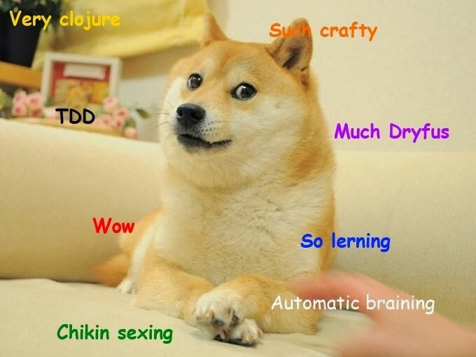

    

I had the opportunity to go to [SCNA](http://scna.softwarecraftsmanship.org/) this year. It was a lot of fun and represented a lot of firsts for me:

* First time going to SCNA.
* First time going to Chicago (and trying the pizza there).
* First time going to a conference outside of Utah.
* First time being in a skyscraper over 20 floors (the event was on the 80th floor!).

I tend to lean towards introversion so conferences can be a bit draining for me but I'm glad I went. I was pulled completely out of my comfort zone which forces me to grow which is one tenant of software craftsmanship that I like.

I thought it would be interesting to put down my thoughts on my experience for anyone interested or at least so that I can reflect on them later.<!--more-->

### Overall Themes

    

#### TDD

Within the software craftsmanship community, test-driven development is one of those things that's just expected. It's no longer new, hip or edgy, it's just what you do when you develop. You don't want to hit people over the head with it but it should be something that you are actively trying to improve on.

#### Naming

Naming is one of the hardest things in software development. If you've ever tried to work on code where a method name says one thing but the code ends up doing way more than was advertised, you know how important naming really is. My favorite thought was from [Sarah Gray](https://twitter.com/fablednet): "naming is an extension of thinking".

#### Dreyfus Model of Skill Acquisition ([link](http://en.wikipedia.org/wiki/Dreyfus_model_of_skill_acquisition))

The Dreyfus model of skill acquisition (or skill expertise) came up many times during the conference. You can follow the header link for more information but the major themes were to not get yourself stuck in the advanced beginner stage and also to strive for mastery to be able to rely more on intuition rather than active thinking.

I found these topics to be very interesting as I feel that I got stuck in the advanced beginner stage a lot in the past. Oh, I still get there occasionally but being aware of it helps me get unstuck before it becomes too much of a problem. [The book I'm currently reading](http://www.amazon.com/Pragmatic-Thinking-Learning-Refactor-Programmers/dp/1934356050) talks a lot about this and is worth reading if you want more information.

Striving for mastery is ultimately what software craftsmanship is about and it was nice to see people talk about why. Why do we strive for mastery? Is it so we can say we're better than others?

We tend to have a finite amount of deliberate thinking cycles which limit how many tasks we can juggle in our heads at any time. When we first learned to drive, we probably couldn't even listen to the radio because all of our concentration was on driving. With years of practice, we can even kind of zone out on a commute and wonder how we got home.

With enough practice, we can move deliberate, effortful tasks to the intuitive, automatic parts of our brain. This frees up deliberate cycles to work on more important tasks that require our attention. The important thing here is practice.

### Favorite Talks

I enjoyed pretty much every session at SCNA. Some were nice because they reinforced what I already knew while others were simply entertaining. There were a few that stood out and made me think.

#### Ken Auer - Craftsmen Cannot Live on Stack Overflow and Github Alone

Software teams will usually have or work with a "subject matter expert". This person is usually very familiar with the business problem that the software is trying to solve. They may not know the technical details on <i>how</i> to solve the problem but they know if the problem has been solved or not. Ken pointed out that as software developers (or craftsmen), we should be subject matter experts as well; not of the business but of quality code. After all, who else will point out when code has become too smelly or will become a maintenance nightmare?

One harsh reality of software development (and [Uncle Bob pointed this out recently](http://blog.8thlight.com/uncle-bob/2013/11/25/Novices-Coda.html)) is a development team is limited by the expertise of the most skilled member. This is something I've always felt strongly about as while I don't mind helping less skilled developers improve, unless there's someone more skilled than I am on the team, I know I'm going to stagnate or worse, get stuck in the advanced beginner stage. This also got me thinking about pairing and how it can expedite the process of getting everyone on a team on the same expertise level.

#### Dave Thomas - Unknown Knowns

This session kind of broke my brain and I still don't fully understand what was being taught. What I did get out of the session was experts have tacit knowledge that is difficult to pass on to other people.

Tacit knowledge is knowledge that you can't necessarily write down for people to reference later. Because of that, it's important to teach what you have learned, rather than what you have been taught. For example, we teach unit testing but the reasons why we test are more interesting since there may be a better way to solve the problem testing solves, we just haven't found it yet. If we teach with passion, we can infuse some of that tacit knowledge into others.

#### Ron Jeffries & Chet Hendrickson - Nature of Software Development

Ron and Chet told an interesting story about how product owners say that they didn't want to be product owners anymore. It was too stressful being this magical person that just knew how everything was supposed to work, what needed to be done and to get everything ready for developers to "just do teh codez".

One product owner suggested that they wanted the whole team to be the product owner. We are all cast members putting on a show. Every part of the vision should be shared.

### Conclusion

I would really like to go to this conference again. The way the sessions were laid out were great and the speakers were top-notch. I was able to meet or listen to some people that I greatly admire in the industry. I feel that the software craftsmanship movement is important to our industry and I'm glad there are a lot of people out there that feel  the same way.

I would also like to give a shout-out to my employer [Ancestry.com](http://ancestry.com/) for footing the bill as well. I always feel that it's my responsibility to keep myself trained but it's nice when your employer is willing to help out.
